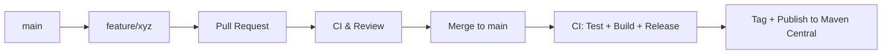
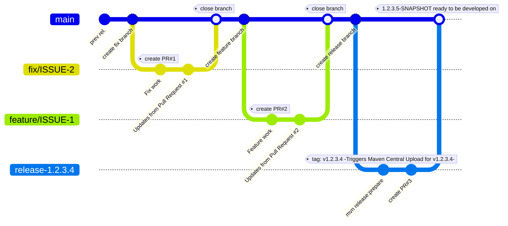

# OTM Java Library

This Java library provides convenient tools and data structures for working with the Open Trip Model (OTM) version 5. It aims to simplify the integration of OTM data into Java-based applications, making it easier for shippers, carriers, software vendors, OEMs, and truck manufacturers to leverage real-time logistic trip data.

## About OTM

The Open Trip Model (OTM) specification is a lightweight data model designed to facilitate the exchange of real-time logistic trip data over the internet between various parties. Its goal is to streamline communication and enable the creation of multi-brand applications and services within the logistics and traffic ecosystem.

You can download the OpenAPI specification for OTM v5 [here](link to OpenAPI specification - replace with actual link).

## Features

This library offers:

* **Data model classes:** Java classes representing the core OTM entities (e.g., Trip, Location, Event). 
* **Parsing/Serialization utilities:** Functionality to easily convert between OTM JSON and Java objects. 

* **Support for OTM version 5.**

## Getting Started

### Prerequisites

* Java Development Kit (JDK) 8 or higher

### Installation

You can include this library in your project using Maven.

**Maven:**

```xml
<dependency>
    <groupId>[your group ID]</groupId>
    <artifactId>[your artifact ID]</artifactId>
    <version>[your version]</version>
</dependency>
```
Replace `[your group ID]`, `[your artifact ID]`, and `[your version]` with the appropriate values for your project.
### Usage
To use the OTM Java library, you can start by creating instances of the data model classes and using the provided utilities to parse or serialize OTM data.

```java
import com.yourpackage.otm.Trip;
import com.yourpackage.otm.Location;
import com.yourpackage.otm.Event;
import com.yourpackage.otm.utils.OtmParser;
   
public class OtmExample {
    public static void main(String[] args) {
        // Create a new trip
        Trip trip = new Trip();
        trip.setId("trip123");
        
        // Add a location to the trip
        Location location = new Location();
        location.setId("loc456");
        location.setName("Warehouse A");
        trip.addLocation(location);
        
        // Serialize the trip to JSON
        String json = OtmParser.serialize(trip);
        System.out.println("Serialized Trip: " + json);
        
        // Parse a JSON string back to a Trip object
        Trip parsedTrip = OtmParser.parse(json, Trip.class);
        System.out.println("Parsed Trip ID: " + parsedTrip.getId());
    }
}
``` 
### License
This library is licensed under the [MIT License](LICENSE). You are free to use, modify, and distribute this library in your projects, provided you include the original license text.
### Contact
For any questions or support, please contact us at [your email address] or visit our [GitHub repository](link to GitHub repository - replace with actual link).


# 🤝 Contributing
We welcome contributions to the OTM Java library! If you have suggestions, bug reports, or feature requests, please open an issue on our GitHub repository. Pull requests are also welcome.  We follow a simple and contributor-friendly Git branching model, along with automated Maven releases. Please read below before submitting code.
This project follows a lightweight branching strategy based on GitHub Flow, with short-lived branches for features and fixes, and a dedicated release branch for tagging and deploying stable versions. All code changes go through pull requests and are merged into the main branch, which is always production-ready. Releases are triggered automatically through GitHub Actions when a release-* branch is prepared, ensuring clean versioning and reliable publishing to Maven Central.

## 🔁 Workflow Summary High-Level Overview


## Git Branching Model




# 🚦 Branching Model

We follow a work flow best described as **GitHub Flow + release branches for tagging and Artifact deployment (i.e: Maven Central)**
```  
main: Always stable and ready for release.  
Every merge to main should be production-ready.  

feature/*: Short-lived branches for new functionality.  
fix/*: Short-lived branches for bug fixes.  
chore/*: Short-lived branches for non-functional changes (tooling, docs, etc.).  
release-*: Temporary branch used to prepare and tag a new release.  
```  

All branches are created directly from `main`.

# 🔀 Pull Requests

All code changes must go through a Pull Request (PR). Here’s the workflow:
1.  Fork the repository (if external contributor)
2.  Create a short-lived working branch:
    - For features:
      ```  
      git checkout -b feature/your-feature-name  
      ```  
    - For fixes:
      ```  
      git checkout -b fix/your-bugfix-description  
      ```  
3.  Commit your changes with clear, atomic messages
4.  Open a PR against `main`
5.  Ensure all checks (tests, formatting, linting) pass

✅ We prefer **squash merges** to keep the history clean.  
🔁 Branches should be **deleted after merge**.

# 🚀 Releasing

Releases are prepared from a dedicated `release-*` branch.


1. After all required changes are merged into `main`, create a release branch:
```
git checkout main
git pull origin main
git checkout -b release-1.0.1.0
# push the branch, so the PR can be used to get the next -SNAPSHOT version available
# git push origin release-1.0.1.0
# howver, the maven release plugin does this for you so this step is optional (see next step)
```

2. Run the release preparation step, typically:
   ```  
   mvn release:clean release:prepare  
   ```  
   This triggers:
    * Runs a local maven build with tests but does **not** deploy to maven central
    * Updates the version number in the pom.xml from 1.0.1.0-SNAPSHOT to 1.0.1.0
    * commits the pom.xml to the branch
    *  Creates the tag `v1.0.1.0` and pushes this to github
    *  updates the pom.xml again to 1.0.1.1-SNAPSHOT and commits the pom.xml to the release branch
3. Create a pull request to merge the updated pom.xml to main (After release, the `release-*` branch may be deleted)

The tag creation triggers a Github Action that runs this action
```
mvn release:perform 
```
This will do the signing of the artifacts and upload the jar file to maven central


# 📌 Versioning

We use a modified Semantic Versioning format to reflect the OTM schema version in the first two segments:

```  
OTM-MAJOR.OTM-MINOR.FEATURE.PATCH  
```  
## Examples:

| Change Type         | Version Example   | Description                                                      |
| ------------------- | ----------------- | ---------------------------------------------------------------- |
| Breaking changes    | 5.6.0.0 → 5.7.0.0 | Incompatible API change                                          |
| New features        | 5.6.1.0 → 5.6.2.0 | Backwards-compatible enhancements (e.g., adding a new validator) |
| Bug fixes / patches | 5.6.2.0 → 5.6.2.1 | Backwards-compatible bug fix (e.g., fixing the new validator)    |

# 💬 Questions?
Feel free to open a Discussion or Issue if you need help!
