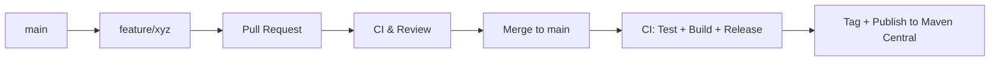

# OTM Java Library

This Java library provides convenient tools and data structures for working with the Open Trip Model (OTM) version 5. It aims to simplify the integration of OTM data into Java-based applications, making it easier for shippers, carriers, software vendors, OEMs, and truck manufacturers to leverage real-time logistic trip data.

## About OTM

The Open Trip Model (OTM) specification is a lightweight data model designed to facilitate the exchange of real-time logistic trip data over the internet between various parties. Its goal is to streamline communication and enable the creation of multi-brand applications and services within the logistics and traffic ecosystem.

You can download the OpenAPI specification for OTM v5 [here](link to OpenAPI specification - replace with actual link).

## Features

This library offers:

* **Data model classes:** Java classes representing the core OTM entities (e.g., Trip, Location, Event). 
* **Parsing/Serialization utilities:** Functionality to easily convert between OTM JSON and Java objects. 

* **Support for OTM version 5.**

## Getting Started

### Prerequisites

* Java Development Kit (JDK) 8 or higher

### Installation

You can include this library in your project using Maven.

**Maven:**

```xml
<dependency>
    <groupId>[your group ID]</groupId>
    <artifactId>[your artifact ID]</artifactId>
    <version>[your version]</version>
</dependency>
```
Replace `[your group ID]`, `[your artifact ID]`, and `[your version]` with the appropriate values for your project.
### Usage
To use the OTM Java library, you can start by creating instances of the data model classes and using the provided utilities to parse or serialize OTM data.

```java
import com.yourpackage.otm.Trip;
import com.yourpackage.otm.Location;
import com.yourpackage.otm.Event;
import com.yourpackage.otm.utils.OtmParser;
   
public class OtmExample {
    public static void main(String[] args) {
        // Create a new trip
        Trip trip = new Trip();
        trip.setId("trip123");
        
        // Add a location to the trip
        Location location = new Location();
        location.setId("loc456");
        location.setName("Warehouse A");
        trip.addLocation(location);
        
        // Serialize the trip to JSON
        String json = OtmParser.serialize(trip);
        System.out.println("Serialized Trip: " + json);
        
        // Parse a JSON string back to a Trip object
        Trip parsedTrip = OtmParser.parse(json, Trip.class);
        System.out.println("Parsed Trip ID: " + parsedTrip.getId());
    }
}
``` 
### License
This library is licensed under the [MIT License](LICENSE). You are free to use, modify, and distribute this library in your projects, provided you include the original license text.
### Contact
For any questions or support, please contact us at [your email address] or visit our [GitHub repository](link to GitHub repository - replace with actual link).


# 🤝 Contributing
We welcome contributions to the OTM Java library! If you have suggestions, bug reports, or feature requests, please open an issue on our GitHub repository. Pull requests are also welcome.  We follow a simple and contributor-friendly Git branching model, along with automated Maven releases. Please read below before submitting code.

# 🌿 Branching Model

We follow a simplified GitHub Flow:
```
main: Always stable and ready for release. Every merge may trigger a Maven release.
feature/*: Used for new functionality.
fix/*: Used for bug fixes.
chore/*: Used for tooling and non-functional changes.
```

You can branch directly off main.

# 🔀 Pull Requests

All code changes must go through a Pull Request (PR). Here’s how:
1.	Fork the repository
2.	Create a feature branch:
```
git checkout -b feature/your-feature-name
```
3.	Commit your changes with clear messages
4.	Open a PR against main
5.	Make sure all checks (tests, formatting, etc.) pass

We prefer squash merges to keep a clean history.

# 🚀 Releasing (Automated)

Merges to main can trigger a Maven release via GitHub Actions. This includes:
* Running tests
* Building the artifact
* Publishing to Maven Central
* Creating a Git tag (v1.2.3)
* Publishing release notes

# 📌 Versioning
We use a form of Semantic Versioning (SemVer)with the change being that we incorporate the OTM schema version as the first two digits of the release.:
```aiexclude
OTM-MAJOR.OTM-MINOR.FEATURE.PATCH
```
| Change Type | Version Example | Description
-- | --- | ---
| Breaking changes | 5.6.0.0 → 5.7.0.0  | Incompatible API change
| New features | 5.6.1.0 → 5.6.2.0 | Backwards-compatible enhancements (e.g., adding a new validator)
| Bug fixes / patches | 5.6.2.0 → 5.6.2.1 | Backwards-compatible bug fix (e.g., fixing the new validator)


# 🔁 Workflow Summary



# 💬 Questions?
Feel free to open a Discussion or Issue if you need help!
